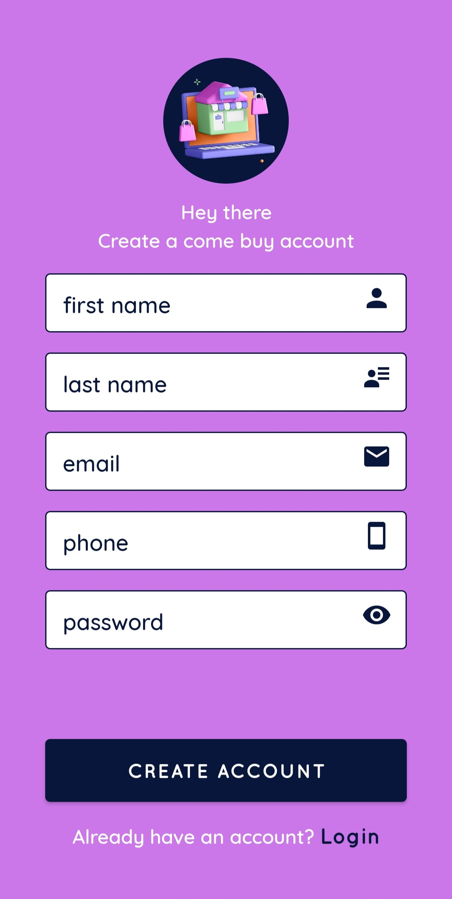
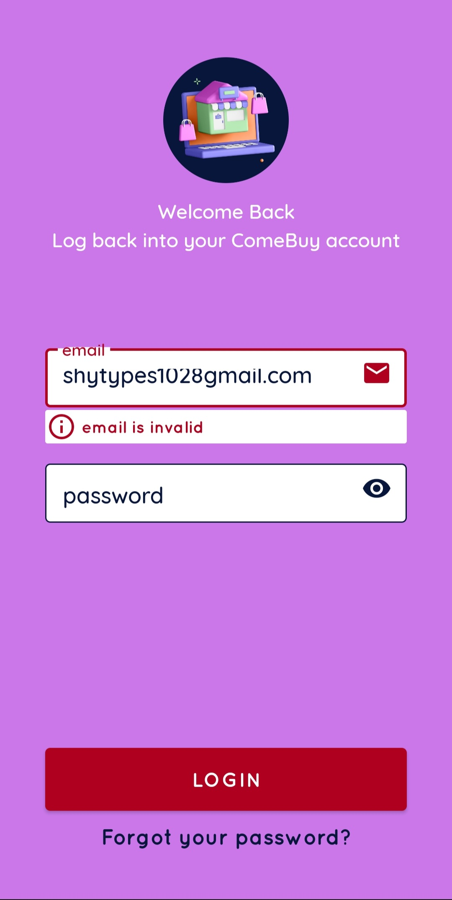
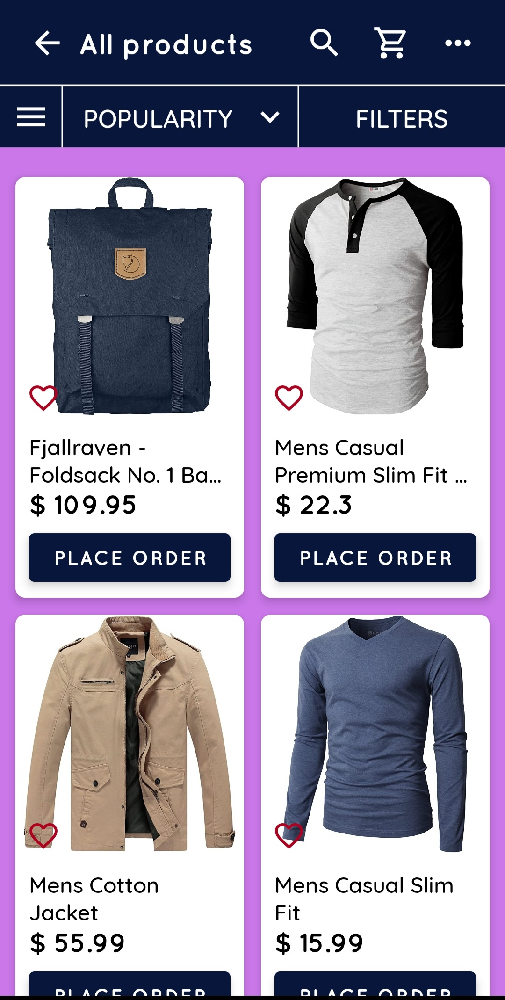
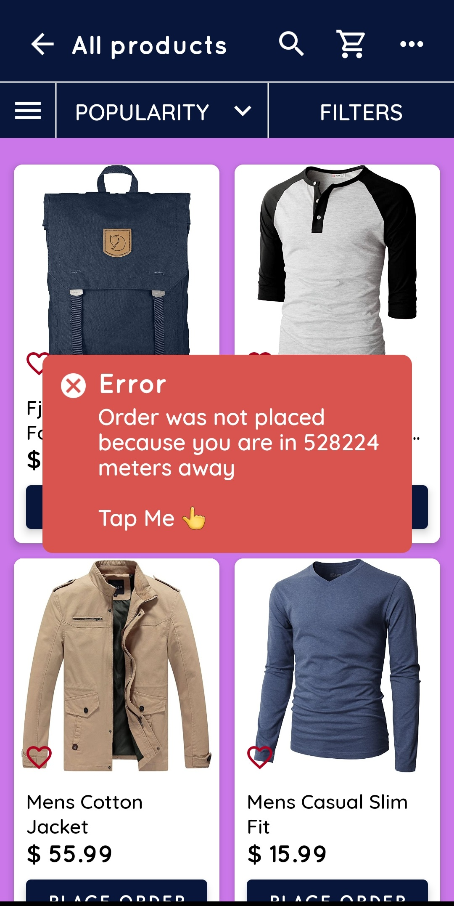

# Come Buy v1

A basic geo-fenced e-commerce app implemented with React native (Typescript) please find attached in the release section a working installable binary build thank you. the build job was a success on expo servers regardless of the workflow error message displayed here thank you.

# Table of contents

1. Installation
2. Project structure
3. Usage/user story
4. Author
5. Features
6. Tech stack
7. Appendix

## Installation

- clone repo

  ```
      git clone https://github.com/AdamuAbba/come_buy.git
  ```

- install dependencies

  ```
      yarn
  ```

- run android build `locally or check package.json scripts command chords`

  ```
      npx expo run:android
  ```

## Project structure

- screens
  - auth
    - sign in screen
    - sign up screen
  - main
    - Dashboard screen

    

## User story

- A user can go through the simulated offline authentication flow with basic form validations
- A user can scroll through products and try to place an order on any of available items by `tapping on the PLACE ORDER` button,

## Author

- [Abba Adamu](https://github.com/AdamuAbba)

## 🔗 Links

<a href="https://www.facebook.com/izshytypes" target="_blank">

</a>
<a href="https://www.instagram.com/shytypes1028/" target="_blank">

</a>
<a href="https://twitter.com/shytypes1028">

</a>
<a href="https://www.linkedin.com/in/abba-adamu"  target="_blank">

</a>
<a href="https://www.linkedin.com/in/abba-adamu">

</a>

## Features

- Simplistic design
- Consistent design/theming with [NativePaper]("https://reactnativepaper.com")
- Local state management with [Redux](https://redux-toolkit.js.org/)
- Basic form validation with [yup validation](https://github.com/jquense/yup)
- Internal form state management with [formik](https://formik.org/)
- [fake store api](https://fakestoreapi.com/) as service/api layer
- Api access layer/data caching using [RTK Query](https://redux-toolkit.js.org/tutorials/rtk-query) which was later swapped out for a basic JSON offline data in accordance to the requirement

## Tech Stack

**Client:** 


**Server:** JSON Data

## Appendix

**Implementation summary:**

- provided is a distance validation function that requests for the device location permission and if granted uses the [geodist](https://www.npmjs.com/package/geodist) package to calculate the distance between the users coordinates and the assumed fixed constant

- Basic simulated user authentication
- Each component is modularized
- A custom Github workflow triggers eas-updates for the `production channel` and `production branch` on expo.binary production builds are also triggered from the same `main` branch as well

```
Component "folder level"
│   Component.styles.ts
│   Component.tsx
│   index.tsx

```
